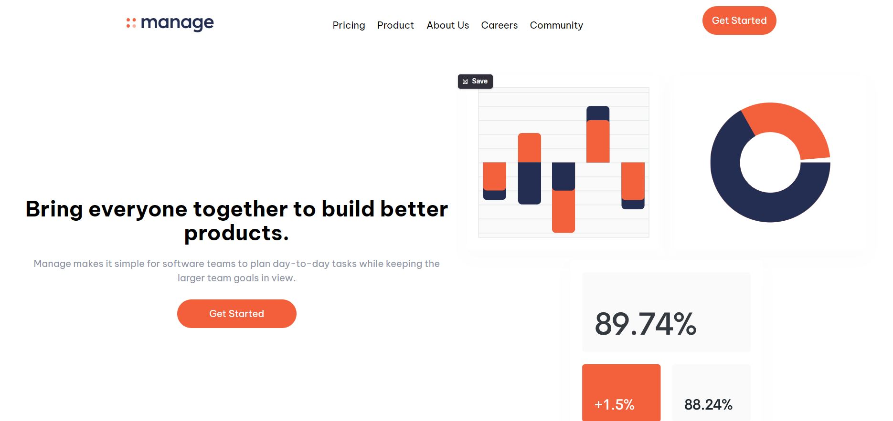

# Frontend Mentor - Manage landing page solution

This is a solution to the [Manage landing page challenge on Frontend Mentor](https://www.frontendmentor.io/challenges/manage-landing-page-SLXqC6P5). Frontend Mentor challenges help you improve your coding skills by building realistic projects.

## Table of contents

-  [Overview](#overview)
   -  [The challenge](#the-challenge)
   -  [Screenshot](#screenshot)
   -  [Links](#links)
-  [My process](#my-process)
   -  [Built with](#built-with)
   -  [What I learned](#what-i-learned)
   -  [Continued development](#continued-development)
   -  [Useful resources](#useful-resources)
-  [Author](#author)
-  [Acknowledgments](#acknowledgments)

## Overview

This was a great challenge and also my first full landing page Challenge I have been able to complete

### Screenshot

### Links

-  Solution URL: [Add solution URL here](https://www.frontendmentor.io/solutions/manage-landing-page-LIoJLSREoa)
-  Live Site URL: [Add live site URL here](https://manage-landingpage-tailwind-soloution.netlify.app/)

## My process

I just built this simply through mobile first method using Html them tailwind tags in the HtMl to style the work

### Built with

-  Semantic HTML5 markup
-  Tailwind CSS
-  Flexbox
-  CSS Grid
-  Mobile-first workflow

### What I learned
Ilearnt Alot.
Majorly learnt Tailwind CSS

### Continued development

more developement in the Javascript aspect in future

## Author

-  Frontend Mentor - [@repzy001](https://www.frontendmentor.io/profile/repzy001)
-  Twitter - [@samuel_ade0001](https://www.twitter.com/samuel_ade0001)

